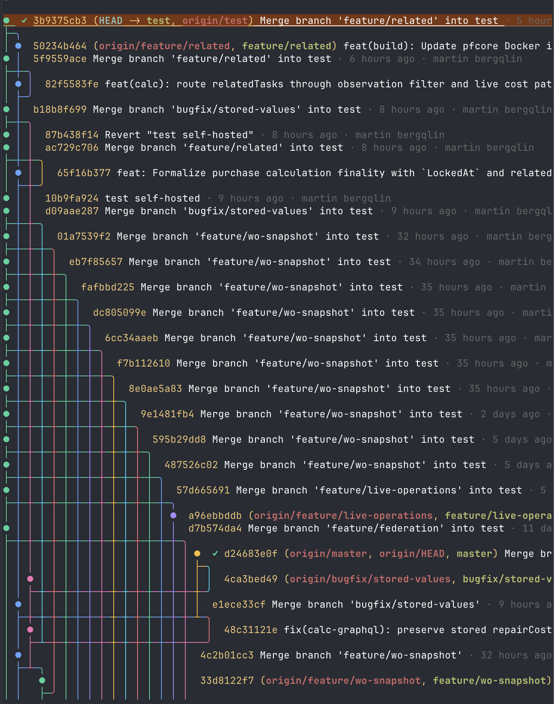

# gitui

A terminal UI for browsing your git history as a coloured tree, with branch
actions and GitHub pipeline status baked in.

 



## Features

- Topological commit graph with per-lane colour, current-branch highlight, and
  HEAD underline.
- Cursor-driven branch actions on `⏎` (checkout, merge, rebase onto main, open
  PR, push / push-with-lease, open pipeline).
- Live GitHub Actions pipeline status next to each branch (running spinner,
  success / failure / cancelled icons).
- Auto-refresh every 5s (configurable) — fetches origin, rebuilds graph,
  re-polls pipelines.
- Contextual footer hints based on current git state (dirty tree, conflicts,
  ahead / behind, synced and ready for PR, failed pipeline, …).
- Claude integration: `c` runs `claude /commit`, `x` runs
  `claude /resolve-conflicts`, and a failed rebase auto-hands off to claude.

## Requirements

- `git` on `PATH`
- `gh` (GitHub CLI), authenticated — required for pipeline status and PR
  creation. See <https://cli.github.com/> for install instructions.
- `claude` on `PATH` — only required for the `c` / `x` shortcuts and rebase
  conflict handoff. Other features work without it.
- A nerd-font terminal for the default branch icon (or pass `--no-icons`).

## Install

### Pre-built binary

Grab a release from the
[Releases page](https://github.com/ourstudio-se/gitui/releases) and put it on
your `PATH`:

```sh
# macOS arm64 example
curl -L https://github.com/ourstudio-se/gitui/releases/latest/download/gitui_darwin_arm64.tar.gz \
  | tar xz
sudo mv gitui /usr/local/bin/
```

### From source

Requires Go 1.26+:

```sh
go install github.com/ourstudio-se/gitui@latest
```

Or clone and build:

```sh
git clone git@github.com:ourstudio-se/gitui.git
cd gitui
go build -o gitui .
```

## Usage

```sh
gitui                    # current directory
gitui --repo path/to/repo
gitui --n 1000           # show up to 1000 commits (default 500)
gitui --refresh 10       # refresh interval in seconds (default 5)
gitui --no-icons         # disable nerd-font glyphs
gitui --dump             # render graph to stdout, no TUI
```

### Keys

| key       | action                                                         |
|-----------|----------------------------------------------------------------|
| `↑` / `k` | move cursor up                                                 |
| `↓` / `j` | move cursor down                                               |
| `g`       | jump to top                                                    |
| `G`       | jump to bottom                                                 |
| `⏎`       | open branch action picker for the highlighted commit           |
| `c`       | run `claude /commit`                                           |
| `x`       | run `claude /resolve-conflicts`                                |
| `r`       | refresh (fetch + rebuild)                                      |
| `f`       | fetch only                                                     |
| `h` / `?` | toggle help dialog                                             |
| `esc`     | close any dialog                                               |
| `q`       | quit                                                           |

Inside the action picker:

| key | action                                        |
|-----|-----------------------------------------------|
| `c` | checkout the highlighted branch               |
| `m` | merge the highlighted branch into the current |
| `b` | rebase current branch onto `origin/main`      |
| `p` | open a PR to main via `gh pr create`          |
| `u` | push (uses `--force-with-lease` if diverged)  |
| `o` | open the GitHub Actions run in the browser    |

## License

MIT
